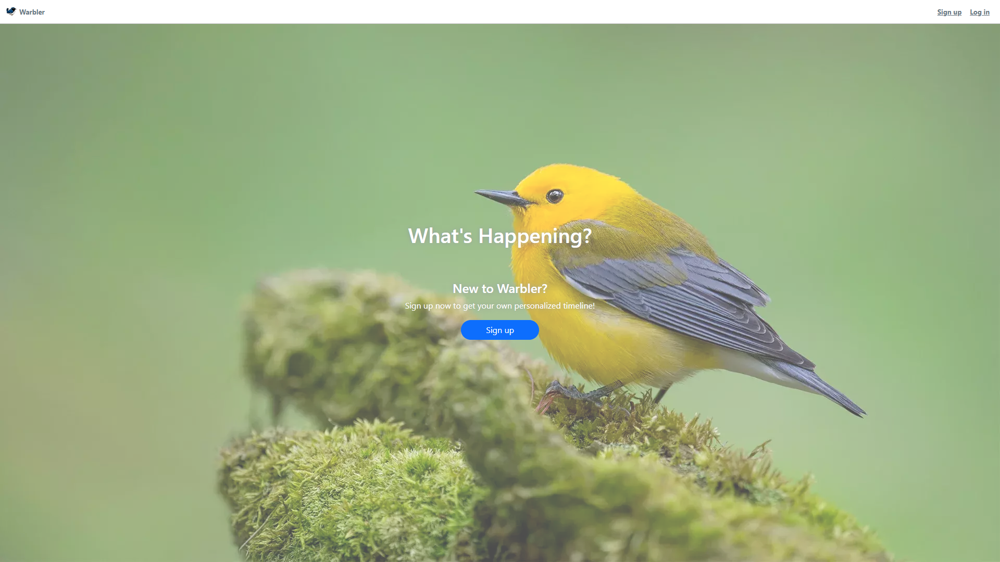
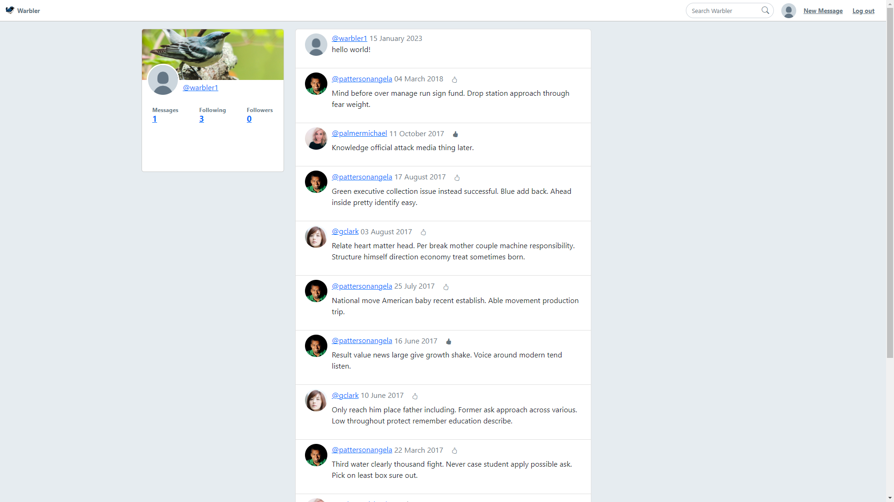

# warbler

Warbler is a full stack web application that is a clone of twitter. It was created in a 5-day sprint while learning about python, Flask, and web security.

## Demo





## Technologies

- python
- Flask
- PostgreSQL
- SQLAlchemy
- Bootstrap

## Features

- Users can register, login, and logout.
- Routes are protected. Only logged in users can visit certain pages.
- Users can search for other users.
- Users can follow other users.
- Users can create messages.
- Users can like and unlike other user's messages.
- Users can edit their profiles.

Routes are protected using a combination of CSRF forms, Flask globals, and sessions.

```python

@app.before_request
def add_csrf_to_g():
    """If user is logged in, add a CSRF form to Flask global."""

    if CURR_USER_KEY in session:
        g.csrf_form = CSRFForm()

    else:
        g.csrf_form = None


@app.before_request
def add_user_to_g():
    """If we're logged in, add curr user to Flask global."""

    if CURR_USER_KEY in session:
        g.user = User.query.get(session[CURR_USER_KEY])

    else:
        g.user = None

```

Flask form's built in CRSF functionality was used to allow only valid requests.

```python

class LoginForm(FlaskForm):
    """Login form."""

    username = StringField('Username', validators=[DataRequired()])
    password = PasswordField('Password', validators=[Length(min=6)])


class CSRFForm(FlaskForm):
    """CSRF form."""

```

## Testing

Tests were implemented for the models and the views.

To run tests:

```python

python -m unittest -v <name of test or leave blank>

```

## Contributors

- [cli3338198](https://github.com/cli3338198)
- [pdimaano](https://github.com/pdimaano)
